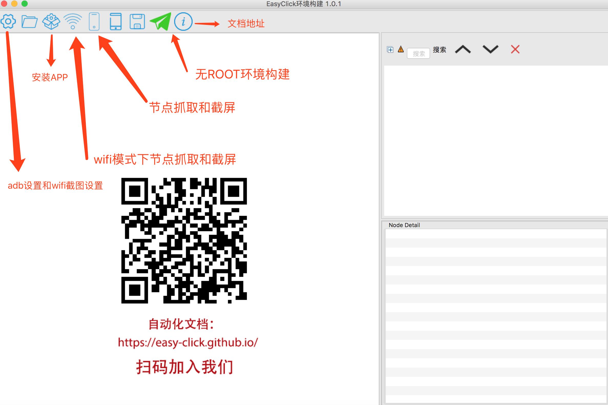

## 开发环境一键安装包
### 包含内容
- JDK 1.8
- Android SDK, 已安装好Android 8.0和9.0的开发环境
- Gradle 5.5.1 
- Android Studio 3.4.2
- EasyClick环境构建软件 最新版本
### 支持环境
- Windows x64 位操作系统，例如：Win7,Win8,Win10 64位系统
### 下载地址
- [Win x64版本百度网盘](https://pan.baidu.com/s/124sTYQAZkedgfnTv3iFTZg) 提取码：7bhy
### 安装
- 安装目录不要带有空格，中文等，可以使用例如: c:/devtool 文件夹
- 下载后将所有zip包放到download文件夹中，installer.exe 与download目录平行
- 以管理员身份运行installer.exe，会自动安装并配置环境变量
- 最后一步是运行 检测环境.bat 文件，没有错误提示就可以正常使用

### 安装后配置
- 配置本地 gradle 加快速度
- 顶部菜单: File -> Settings -> Build,Execution,Deployment -> Gradle -> Use local gradle distribution 选择本地的Gradle文件夹保存即可

## EasyClick 环境构建软件

### 下载地址
- [百度网盘](https://pan.baidu.com/s/1bM7pP04u5X6P2wTKvoDMrw)  提取码：iiax

### 使用教程

