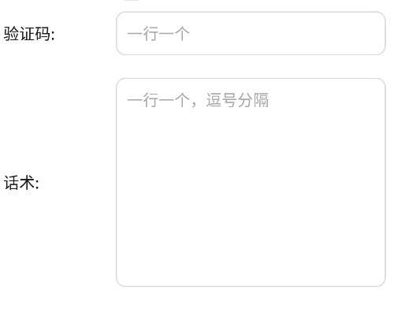
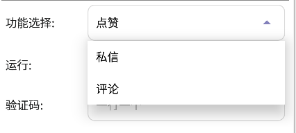
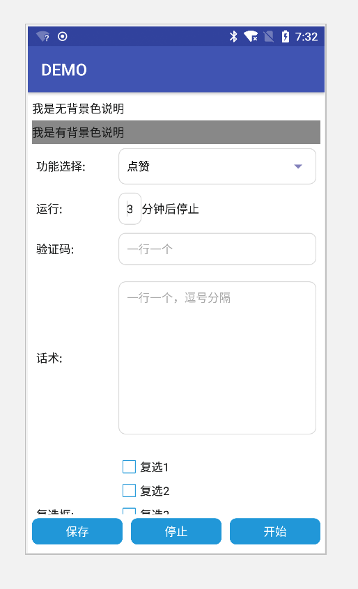

## UI 定制说明
- EasyClick通过配置JSON数据格式的文件，动态生成UI视图

格式如下:


> ```json
> {
> 	"ui": [{
> 		"label": "DEMO",
> 		"line_type": "文本"
> 	}]
> }
> ```

## 文本视图
- 属性：
    - label: 文本的字符串
    - line_type:类型，请填写 文本 
    - background_color: 背景色，可以不填写，例如：#222333

- 实例：
> ```json
> {
> 	"ui": [{
> 		"label": "我是文本",
> 		"line_type": "文本"
> 	}]
> }
> ```

- 效果


## 单行输入框视图
- 属性：
    - label: 文本的字符串
    - line_type:类型，请填写 单行输入框 
    - key: 在程序中获取输入框中的值，需要用到的唯一标记
    - value: 输入框默认值

- 实例：
> ```json
> {
> 	"ui": [{
> 		"label": "账号文件",
> 		"key": "pinglun_account_file",
> 		"value": "/sdcard/ks20190405.txt",
> 		"line_type": "单行输入框"
> 	}]
> }
> ```

- 效果




## 下拉选择框视图
- 属性：
    - label: 文本的字符串
    - line_type:类型，请填写 下拉选择框 
    - key: 在程序中获取输入框中的值，需要用到的唯一标记
    - value: 下拉输入框的值，多个的情况下，用 | 进行分割
    - select_value: 默认选中的值

- 实例：
> ```json
> {
> 	"ui": [{
> 		"label": "功能选择",
> 		"key": "func_select",
> 		"value": "私信|关注|评论点赞",
> 		"select_value": "私信",
> 		"line_type": "下拉选择框"
> 	}]
> }
> ```

- 效果





## 多行输入框视图
- 属性：
    - label: 文本的字符串
    - line_type:类型，请填写 多行输入框 
    - key: 在程序中获取输入框中的值，需要用到的唯一标记
    - value: 输入框默认值
    - line_number: 行数。决定了默认行数大小和高度

- 实例：
> ```json
> {
> 	"ui": [{
> 		"label": "随机评论话术",
> 		"key": "pinglun_rdm_reply",
> 		"value": "",
> 		"line_number": "10",
> 		"line_type": "多行输入框"
> 	}]
> }
> ```

- 效果


## 复选框视图
- 属性：
    - label: 文本的字符串
    - line_type:类型，请填写 复选框 
    - key: 在程序中获取输入框中的值，需要用到的唯一标记
    - value: 复选框的值，多个的情况下，用 | 进行分割
    - select_value: 默认选中的值

- 实例：
> ```json
> {
> 	"ui": [{
> 		"label": "复选框测试",
> 		"key": "fxk",
> 		"value": "功能1|功能2|功能3",
> 		"select_value": "功能1",
> 		"line_type": "复选框"
> 	}]
> }
> ```

- 效果


## 综合实例

> ```json
> {
> 	"ui": [{
> 			"label": "我是文本",
> 			"line_type": "文本"
> 		},
> 		{
> 			"label": "功能选择",
> 			"key": "func_select",
> 			"value": "私信|关注|评论点赞",
> 			"select_value": "私信",
> 			"line_type": "下拉选择框"
> 		},
> 		{
> 			"label": "账号文件",
> 			"key": "pinglun_account_file",
> 			"value": "/sdcard/ks20190405.txt",
> 			"line_type": "单行输入框"
> 		},
> 		{
> 			"label": "随机时间隔(秒)",
> 			"key": "pinglun_delay",
> 			"value": "5 - 15",
> 			"line_type": "单行输入框"
> 		},
> 		{
> 			"label": "随机评论话术",
> 			"key": "pinglun_rdm_reply",
> 			"value": "",
> 			"line_number": "10",
> 			"line_type": "多行输入框"
> 		},
> 		{
> 			"label": "复选框测试",
> 			"key": "fxk",
> 			"value": "功能1|功能2|功能3",
> 			"select_value": "功能1",
> 			"line_type": "复选框"
> 		}
> 	]
> }
> ```


- 效果




## UI界面参数读取

- 参考  [任务类中的API说明](/zh-cn/funcs/task)