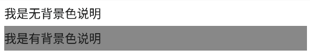
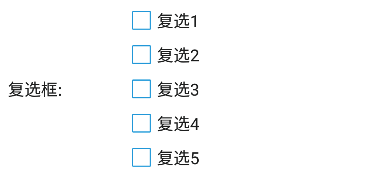

## UI 定制说明
- EasyClick 遵循了Android的UI设计方式，使用Android自带元素和设计器进行设计
- 为了提高开发速度，EasyClick 支持以下UI，并自动设置风格样式:
    - LinearLayout 线性布局
    - TextView 文本视图
    - EditText 输入框或者多行输入框
    - Spinner 下拉选择框
    - CheckBox 复选框

- 你也可以自己编写Android的布局，并自行调用启动脚本的方法

格式如下:

> ```xml
> <?xml version="1.0" encoding="utf-8"?>
> <LinearLayout xmlns:android="http://schemas.android.com/apk/res/android"
>     android:layout_width="match_parent"
>     android:layout_height="match_parent"
>     android:orientation="vertical">
>     <TextView
>         android:layout_width="match_parent"
>         android:layout_height="wrap_content"
>         android:text="我是第一个文本框" />
> </LinearLayout>
> ```

## 文本视图
- 属性：
    - android:text: 文本的字符串
    - android:tag: 唯一标识符，获取参数使用 
    - android:background: 背景颜色，只支持16进制，类似 #222222

- 实例：
> ```xml
> <?xml version="1.0" encoding="utf-8"?>
> <LinearLayout xmlns:android="http://schemas.android.com/apk/res/android"
>     android:layout_width="match_parent"
>     android:layout_height="match_parent"
>     android:orientation="vertical">
>     <TextView
>         android:layout_width="match_parent"
>         android:layout_height="wrap_content"
>         android:text="我是第一个文本框" />
> </LinearLayout>
> ```

- 效果




## 输入框视图
- 属性：
    - android:text: 输入框的字符串
    - android:tag: 唯一标识符，获取参数使用 
    - android:hint: 输入框提示
    - android:minLines: 最小行数，1 单行输入框，其他为多行输入框，用来调节输入框高度和行数

- 实例：
> ```xml
> <?xml version="1.0" encoding="utf-8"?>
> <LinearLayout xmlns:android="http://schemas.android.com/apk/res/android"
>     android:layout_width="match_parent"
>     android:layout_height="match_parent"
>     android:orientation="vertical">
>     <EditText
>         android:id="@+id/editText"
>         android:layout_width="match_parent"
>         android:layout_height="wrap_content"
>         android:hint="我是提示"
>         android:minLines="10"
>         android:text="" />
</LinearLayout>
> ```

- 效果


## 下拉选择框视图
- 属性：
    - android:tag: 唯一标识符，获取参数使用 
    - android:text : 下拉输入框的值，多个的情况下，用 | 进行分割


- 实例：
> ```xml
> <?xml version="1.0" encoding="utf-8"?>
> <LinearLayout xmlns:android="http://schemas.android.com/apk/res/android"
>     android:layout_width="match_parent"
>     android:layout_height="match_parent"
>     android:orientation="vertical">
>     <Spinner
>         android:layout_width="match_parent"
>         android:layout_height="wrap_content"
>         android:tag="func"
>         android:text="私信|点赞|好评" />
</LinearLayout>
> ```

- 效果


## 复选框视图
- 属性：
    - android:tag: 唯一标识符，获取参数使用 
    - android:text : 复选框的值


- 实例：
> ```xml
> <?xml version="1.0" encoding="utf-8"?>
> <LinearLayout xmlns:android="http://schemas.android.com/apk/res/android"
>     android:layout_width="match_parent"
>     android:layout_height="match_parent"
>     android:orientation="vertical">
>     <CheckBox
>         android:layout_width="match_parent"
>         android:layout_height="wrap_content"
>         android:tag="f1"
>         android:text="功能1" />
</LinearLayout>
> ```

- 效果



## 综合实例

> ```xml
> <?xml version="1.0" encoding="utf-8"?>
> <LinearLayout xmlns:android="http://schemas.android.com/apk/res/android"
>     android:layout_width="match_parent"
>     android:layout_height="match_parent"
>     android:orientation="vertical">
> 
> 
>     <TextView
>         android:layout_width="match_parent"
>         android:layout_height="wrap_content"
>         android:text="我是无背景色说明" />
> 
> 
>     <TextView
>         android:layout_width="match_parent"
>         android:layout_height="wrap_content"
>         android:background="#888888"
>         android:text="我是有背景色说明" />
> 
> 
>     <LinearLayout
>         android:layout_width="match_parent"
>         android:layout_height="wrap_content"
>         android:orientation="horizontal">
> 
>         <TextView
>             android:layout_width="100dp"
>             android:layout_height="wrap_content"
>             android:gravity="center_vertical"
>             android:text="功能选择:" />
> 
>         <Spinner
>             android:layout_width="match_parent"
>             android:layout_height="wrap_content"
>             android:tag="func"
>             android:text="点赞|私信|评论"></Spinner>
> 
>     </LinearLayout>
> 
>     <LinearLayout
>         android:layout_width="match_parent"
>         android:layout_height="wrap_content"
>         android:orientation="horizontal">
> 
>         <TextView
>             android:layout_width="100dp"
>             android:layout_height="wrap_content"
>             android:gravity="center_vertical"
>             android:text="运行:" />
> 
>         <EditText
>             android:layout_width="wrap_content"
>             android:layout_height="wrap_content"
>             android:tag="run_min"
>             android:text="3" />
> 
>         <TextView
>             android:layout_width="wrap_content"
>             android:layout_height="wrap_content"
>             android:gravity="center_vertical"
>             android:text="分钟后停止" />
> 
>     </LinearLayout>
> 
>     <LinearLayout
>         android:layout_width="match_parent"
>         android:layout_height="wrap_content"
>         android:orientation="horizontal">
> 
>         <TextView
>             android:layout_width="100dp"
>             android:layout_height="wrap_content"
>             android:gravity="center_vertical"
>             android:text="验证码:" />
> 
>         <EditText
>             android:layout_width="match_parent"
>             android:layout_height="wrap_content"
>             android:hint="一行一个"
>             android:tag="yanzhengma" />
> 
>     </LinearLayout>
> 
>     <LinearLayout
>         android:layout_width="match_parent"
>         android:layout_height="wrap_content"
>         android:layout_marginTop="10dp"
>         android:layout_marginBottom="10dp"
>         android:orientation="horizontal">
> 
>         <TextView
>             android:layout_width="100dp"
>             android:layout_height="wrap_content"
>             android:gravity="center_vertical"
>             android:text="话术:" />
> 
>         <EditText
>             android:layout_width="match_parent"
>             android:layout_height="wrap_content"
>             android:hint="一行一个，逗号分隔"
>             android:minLines="10"
>             android:tag="huashu" />
> 
>     </LinearLayout>
> 
> 
>     <LinearLayout
>         android:layout_width="match_parent"
>         android:layout_height="wrap_content"
>         android:orientation="horizontal">
> 
>         <TextView
>             android:layout_width="100dp"
>             android:layout_height="wrap_content"
>             android:text="复选框:" />
> 
>         <LinearLayout
>             android:layout_width="wrap_content"
>             android:layout_height="wrap_content"
>             android:orientation="vertical">
> 
>             <CheckBox
>                 android:layout_width="wrap_content"
>                 android:layout_height="wrap_content"
>                 android:tag="f1"
>                 android:text="复选1" />
> 
>             <CheckBox
>                 android:layout_width="wrap_content"
>                 android:layout_height="wrap_content"
>                 android:tag="f2"
>                 android:text="复选2" />
> 
>             <CheckBox
>                 android:layout_width="wrap_content"
>                 android:layout_height="wrap_content"
>                 android:tag="f3"
>                 android:text="复选3" />
> 
>             <CheckBox
>                 android:layout_width="wrap_content"
>                 android:layout_height="wrap_content"
>                 android:tag="f4"
>                 android:text="复选4" />
> 
>             <CheckBox
>                 android:layout_width="wrap_content"
>                 android:layout_height="wrap_content"
>                 android:tag="f5"
>                 android:text="复选5" />
>         </LinearLayout>
>     </LinearLayout>
</LinearLayout>
> ```


- 效果


## UI高度和宽度解释
    - 属性为：layout_width, layout_height
    - match_parent 填充满父容器
    - wrap_content 以自身实际宽度为准
    - 数字型，例如：12dp，代表12个dp宽度，dp是android的宽度单位

## UI界面参数读取

- 参考  [任务类中的API说明](/zh-cn/funcs/task)